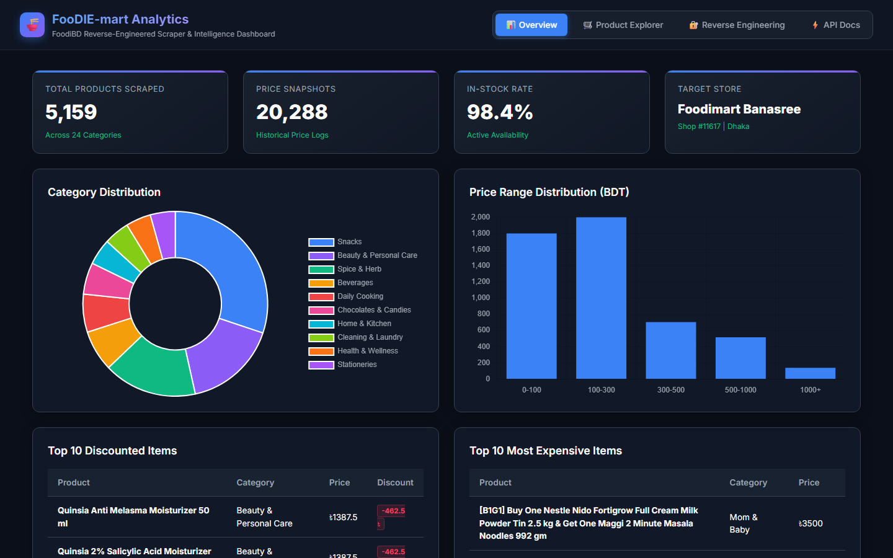
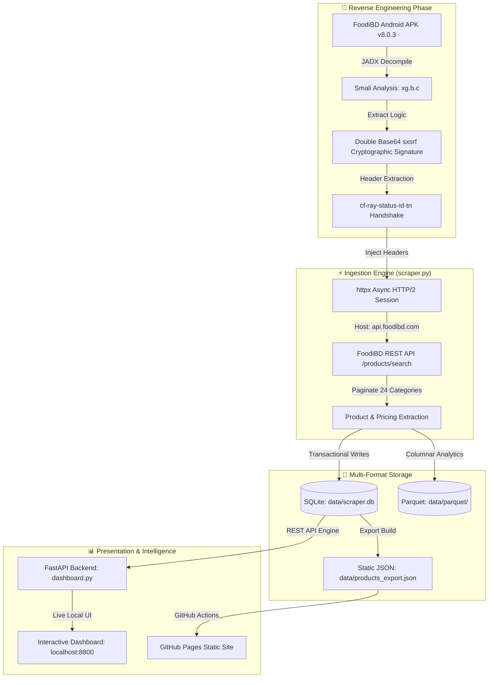

# 🍜 FooDIE-mart Analytics & Deal Intelligence

> **Reverse-Engineered Cryptographic Header Engine, Async HTTP/2 Ingestion Pipeline & Dual SQLite/Parquet Analytics Suite for FoodiBD Mart.**

[](https://github.com/ranehal/FooDIE-mart-Analytics)
[](https://github.com/ranehal/FooDIE-mart-Analytics)
[](https://github.com/ranehal/FooDIE-mart-Analytics)
[](https://ranehal.github.io/FooDIE-mart-Analytics/)
[](#license)

---

## 📌 Executive Summary

**FooDIE-mart Analytics** is an end-to-end data engineering, reverse-engineering, and price monitoring platform built for **FoodiBD Mart** (Shop #11617 - Banasree, Dhaka).

By decompiling the official FoodiBD Android APK (**v8.0.3**) via JADX, this project unlocked the dynamic cryptographic authentication signature (`sxsrf`), bypassed Cloudflare protections, and built an asynchronous HTTP/2 ingestion engine tracking **5,159+ products** across **24 categories**. The system features a **FastAPI backend**, **Chart.js analytics**, **Apache Parquet columnar storage**, and an automated **Deal Intelligence Engine**.

---

## 🚀 Key Features

- **🔐 APK Reverse-Engineering (`xg.b.c`)**: Decompiled Smali class `xg.b.c` from APK v8.0.3 to reproduce double-Base64 `sxsrf` header signatures (`Base64(Base64(token))`) derived from `cf-ray-status-id-tn` response headers.
- **⚡ Async HTTP/2 Ingestion Engine (`scraper.py`)**: Built with `httpx` and `asyncio`, supporting concurrent category pagination, exponential backoff, and stateful session recovery.
- **💾 Dual OLTP/OLAP Storage**:
  - **SQLite Database (`data/scraper.db`)**: Transactional storage indexed on `product_id`, `category_id`, and `scraped_at`.
  - **Apache Parquet (`data/parquet/`)**: Columnar storage engineered for historical price analytics and low-latency queries.
- **🎯 Deal Intelligence Engine**: Automatically classifies items into **Great Deal**, **Good Buy**, **Wait**, and **All-Time Low (ATL)** using rolling 30-day standard deviation and moving averages.
- **📊 Modern Web Dashboard**: Powered by FastAPI & Chart.js, offering price distribution histograms, category breakdown charts, interactive search, price comparison carts, and static GitHub Pages support.

---

## 📸 Screenshots



---

## 🏗️ System Architecture



---

## 📁 Repository Structure

```
FooDIEscraper/
├── scraper.py              # Async HTTP/2 scraper engine (httpx, asyncio, SQLite, Parquet)
├── dashboard.py            # FastAPI REST backend & dashboard server (:8800)
├── index.html              # Static single-page application dashboard
├── requirements.txt        # Python dependencies (httpx, fastapi, pandas, pyarrow)
├── data/
│   ├── scraper.db          # Transactional SQLite database
│   ├── products_export.json# Static JSON export for GitHub Pages
│   └── parquet/            # Apache Parquet columnar historical files
└── README.md               # Detailed technical specification
```

---

## 🛠️ Data Schema & Storage Architecture

### SQLite Transactional Schema (`data/scraper.db`)
- `categories`: `(category_id INTEGER PRIMARY KEY, name TEXT)`
- `products`: `(product_id INTEGER PRIMARY KEY, name TEXT, category_id INTEGER, unit TEXT, image_url TEXT)`
- `price_history`: `(id INTEGER PRIMARY KEY AUTOINCREMENT, product_id INTEGER, price REAL, mrp REAL, discount_percent REAL, in_stock BOOLEAN, scraped_at TIMESTAMP)`

---

## ⚡ Quick Start & Setup

### 1. Install Dependencies
```bash
pip install -r requirements.txt
```

### 2. Execute Async Scraper Engine
```bash
# Run HTTP/2 async ingestion pipeline across 24 categories
python scraper.py
```

### 3. Launch FastAPI Dashboard Server
```bash
python dashboard.py
```
Open `http://localhost:8800` in your browser.

---

## 📜 License

Distributed under the MIT License. Trademarks and data belong to FoodiBD / US-Bangla Group. Built for analytical research.

---

## 🚀 Future Work & Industrial Roadmap

To elevate this platform to an enterprise-grade, production-ready product meeting current industrial standards, the following strategic goals and architecture enhancements are planned:

### 1. 🏗️ High-Availability Microservices & Infrastructure
- **Containerization & Orchestration**: Package ingestion workers, APIs, and dashboards into Docker containers with deployment via **Kubernetes (K8s)** and Helm charts for autoscaling during peak traffic hours.
- **Distributed Ingestion Workers**: Transition from localized scraping scripts to an asynchronous, fault-tolerant worker pool utilizing **Celery + Redis** or **Temporal.io** with automated proxy rotation, rate-limiting retry strategies, and CAPTCHA bypass capabilities.
- **High-Performance API Gateway**: Implement an enterprise API Gateway (Kong / Envoy) providing OAuth2 / JWT authentication, TLS termination, and granular rate limiting (Token Bucket algorithm).

### 2. 📊 Enterprise Data Engineering & Streaming Pipelines
- **Data Lakehouse Architecture**: Store multi-year raw price histories using **Apache Parquet / Delta Lake** or **Google BigQuery** for scalable analytical queries across millions of SKU updates.
- **Real-Time CDC & Message Streaming**: Integrate **Apache Kafka** or **NATS** for Change Data Capture (CDC) to stream price change events instantly to downstream analytics and notification consumers.
- **Automated Workflow Orchestration**: Schedule and monitor data ingestion, ETL pipelines, and unit normalization using **Apache Airflow** or **Prefect** integrated with **dbt** for dynamic data transformations.

### 3. 🧠 Machine Learning & Advanced Market Intelligence
- **Predictive Price Forecasting**: Deploy **Prophet** and **LSTM Neural Networks** to predict future price drops, historical promotion trends, and seasonal discount cycles.
- **Anomaly & Surge Detection**: Build ML models to identify artificial price hikes before promotional sales, mislabeled unit metrics, and phantom stock availability.
- **Semantic Product Entity Matching**: Utilize vector embeddings (OpenAI / Sentence-Transformers) paired with **pgvector** / **Pinecone** to match identical SKUs across competitor platforms despite variations in naming formats.

### 4. 🔐 Security, Compliance & System Observability
- **Zero-Trust Security & RBAC**: Enforce Role-Based Access Control (RBAC), AES-256 GCM payload encryption at rest, and secret rotation via HashiCorp Vault.
- **Full Observability Stack**: Instrument services with **OpenTelemetry**, emitting distributed traces, Prometheus metrics, and structured logs to **Grafana Loki & Tempo** dashboards.
- **SLA Alerting & Webhook Engine**: Provide instant trigger notifications via **Telegram Bot API**, **Discord Webhooks**, email notifications, and enterprise SMS gateways when watched items reach target prices.

### 5. 📱 Next-Gen User Experience & Mobile Platforms
- **Cross-Platform Mobile App**: Develop a dedicated **React Native / Flutter** app featuring push notifications for price drops, barcode scanning in physical stores, and personalized deal watchlists.
- **Progressive Web App (PWA)**: Upgrade the dashboard to a full PWA with offline caching via Service Workers, dynamic theme switching, and desktop application installability.
